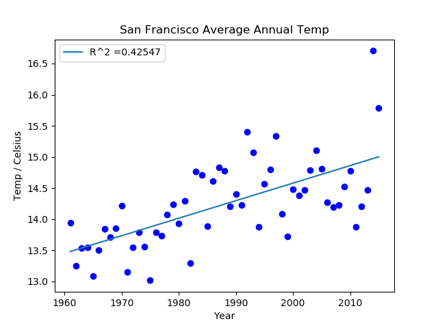
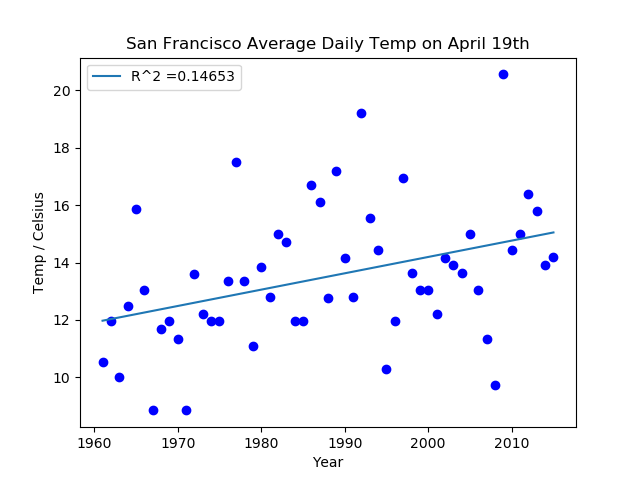

<!-- PROJECT LOGO -->
 

  

<h3 align="center">Climate Change</h3>

  

      The aim of this project is to use regression analysis to model the climate change of various US
      cities from 1961 to 2016 using data from the National Centers for Environmental Information (NCEI).
     
  

<!-- TABLE OF CONTENTS -->

  
Table of Contents

  <ol>
    <li>
      <a href="#about-the-project">About The Project</a>
      <ul>
        <li><a href="#built-with">Built With</a></li>
        <li><a href="#what-i-learned">What I Learned</a></li>
      </ul>
    </li>
    <li><a href="#contributing">Contributing</a></li>
    <li><a href="#license">License</a></li>
    <li><a href="#contact">Contact</a></li>
    <li><a href="#acknowledgments">Acknowledgments</a></li>
  </ol>

<!-- ABOUT THE PROJECT -->
## About The Project

 

To assess climate change throughout various cities in the US, we first import and parse the data obtained from NCIE. We then use the Numpy library to fit the data to a first order polynomial. A function was defined to calcuate
the R squared value to determine how well the model fits the data. Pylab was used to plot the resyluts

Below are a couple of graphs to visualize subsets of the data. The intuition is if climate is changing 
then it may be apparent by looking at either the average annual temperature or the average temperature on a particular day over time.

 

 

 Give it a try for yourself!

### Built With

* [Python](https://www.python.org/)

### What I learned

<ol>
  <li> Regression Analysis </li>
  <li> Defining classes and working with class methods </li>
  <li> Using Numpy library </li>
  <li> Using Pylab library </li>
</ol>

(<a href="#top">back to top</a>)

<!-- CONTRIBUTING -->
## Contributing

Anyone who would like to contribute to this project or has suggestions for improvements are welcomed!

(<a href="#top">back to top</a>)

<!-- LICENSE -->
## License

Distributed under the MIT License. See `LICENSE.txt` for more information.

(<a href="#top">back to top</a>)

<!-- CONTACT -->
## Contact

Zac Cooper - [@zwcoop](https://twitter.com/zwcoop) - zwcoop@protonmail.com

Project Link: [https://github.com/zwcoop/ClimateChange](https://github.com/zwcoop/ClimateChange)

(<a href="#top">back to top</a>)

<!-- ACKNOWLEDGMENTS -->
## Acknowledgments

This project was done as a part of the MITx 6000.2 course I took through the edX online learning platform. A scaffold of the code was provided to build off of. Any errors are of course my own. A special thanks to the MIT professors below for sharing their knowledge and expertise with the world.

* John Guttag
* Eric Grimson
* Ana Bell

[MIT 6000.1x](https://youtube.com/playlist?list=PLRJdqdXieSHN0U9AdnmwD-9QcR9hmw04d)

[MIT OPENCOURSEWARE](https://ocw.mit.edu/courses/6-0002-introduction-to-computational-thinking-and-data-science-fall-2016/)

(<a href="#top">back to top</a>)

